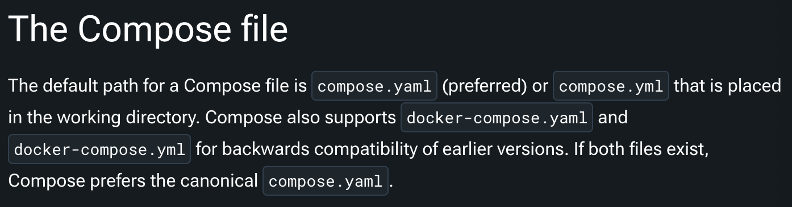
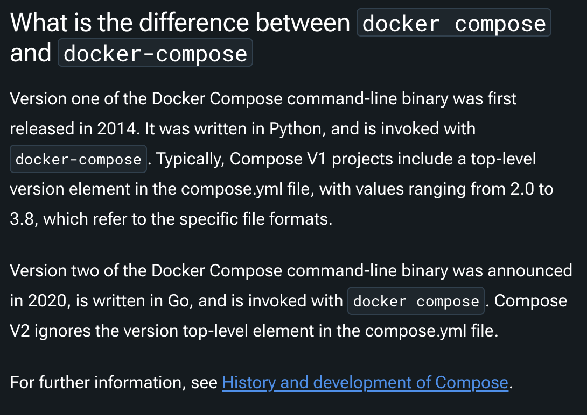
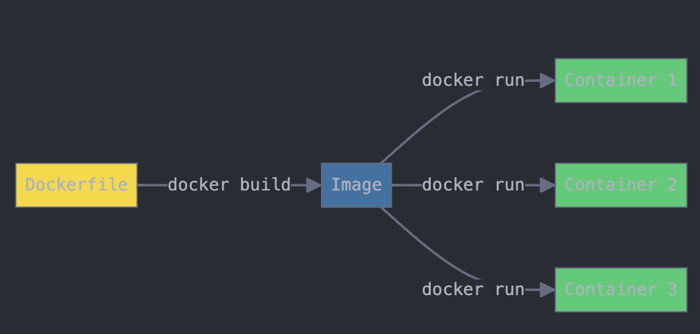
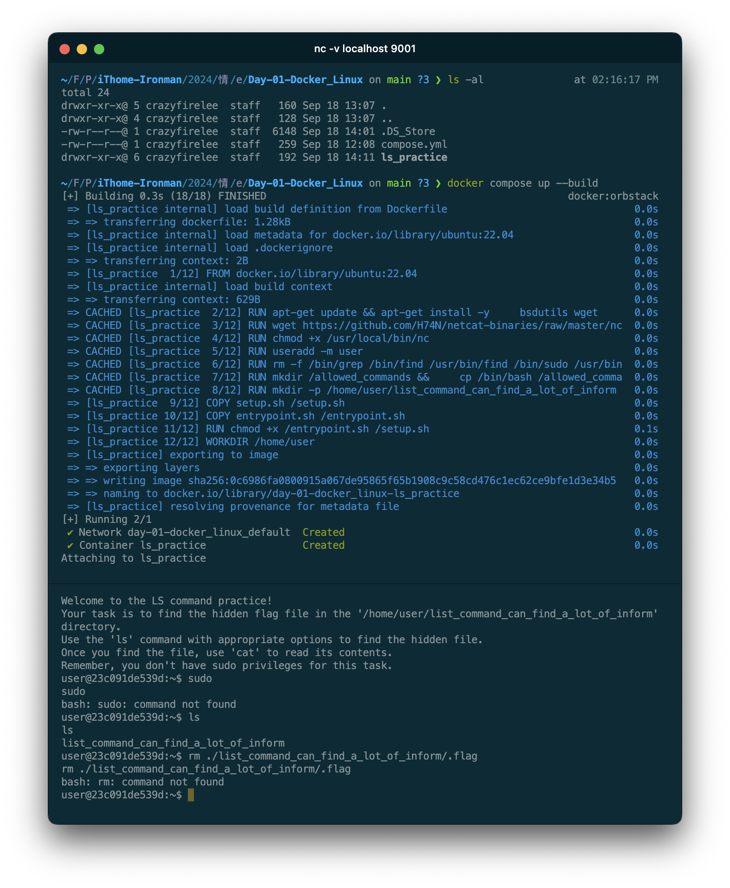

# Day-01 - 為了講課而進行的技術反思 Part 01 - 用 Docker 來出 OS 的題目吧！如何避免非預期的題目操作與檔案刪除？

還記得那是個風光明媚的下午，我正在實驗室中「愉悅的」寫著我的畢業論文，叮咚，我的手機響了一下。

「火笨，你今年可以支援活動嗎？幫忙講課一下。」，啊，原來是計畫助理的小凱的訊息呀～那我就安...等等？講課？我？！

壓抑著激動的心情與顫抖的雙手，我回覆了小凱：「今年...今年總算輪到我了嗎？」，「沒問題，就交給我吧！」。

開開心心的答應了小凱的邀約，輕輕鬆鬆地準備著課程與題目，心裡想著：「拜託，我都講幾次課了，這個課程一樣是輕輕鬆鬆 Des 啦～」。

叮咚，叮咚，叮咚，我的手機又響了，這次是我的好麻吉小遠：「火笨，聽說這次你也講課，完蛋了，題目今年要放在哪裡？學生們又要開始破壞我們的題目啦！」。

看著訊息，我心中坑愣了一下...這就是本次的故事的開始...。

回想起去年當助教的情景，我就一陣後怕，每年活動的高中生真的是令人捉摸不定又愛又恨，其中最令人頭痛的就是對於練習題目的破壞力。今年為了解決這個問題，避免每次學員們上課都會因為題目被其他同學刪掉而無法練習，我們勢必需要針對這個問題做一些改變。

尤其今年希望講解到的題目內容中有 Linux 相關的練習，想藉由簡單的題目設計來引導學員們了解 Linux 的基本操作、檔案系統、權限等等不同的知識，如果學員們無法順利練習，那麼這次的課程就會失去了意義。為此就讓我們來聊聊如何設計與保護我們的題目吧！

## 情境設定 - Docker / Linux

這次的課程我們使用了 CTFd 作為解題與練習的平台，同時為了方便管理與確保題目在環境中不會被互相影響，我們決定用 Docker 來進行題目的架設與維護。這樣的好處很直觀，

1. 雖然所有題目皆架設在同一台主機中，但因為 Docker 的隔離性，可以確保題目之間不會互相影響。
2. Docker 可以協助我們快速建立、調整題目，並且還擁有很棒的性能表現，不會犧牲太多效能。

在所有人的共識下，我們決定將所有題目都建立成一個一個的 Docker 容器進行建立與維護，而且所有類型的題目都可以設計。

讓我們先趁機了解 Docker 吧！

### Docker 的常用工具與做法

Docker 身為一個容器化工具，擁有許多優秀的特性與優勢，使其成為現階段管理與維護服務的好幫手。容器化技術可以想像成另外一種虛擬化技術，只是其虛擬化的層級更高，且允許我們用類似「應用程式」角度去思考跟管理這些服務。

也因此在利用 Docker 建立應用的過程中，我們往往會希望所有容器各司其職，不會再把所有東西都塞到同一個容器中，因此舉例來說，當我們想要提供一個簡易的會員平台時，以往使用虛擬機的建立方式為一個虛擬機中會有網頁前後端、資料庫、Redis 等等服務，但在 Docker 中我們會希望將這些服務分開，例如：Apache / Nginx 各自為一個容器、資料庫為一個容器、Redis 為一個容器，這樣的好處是可以讓我們更容易管理與維護這些服務。

但也代表著以下情境的發生：

1. 啟動單一「服務」時，往往會需要同步啟動與管理許許多多的容器，來互相配合成就一個完整的服務，這時會用到 Docker Compose 的方式來更好的管理服務。
2. 每個容器皆會有自己會需要客製化、調整與建立的內容，這些內容不會跟外面官方提供的容器相同，因此我們需要透過 Dockerfile 來建立自己的容器。
3. 由於容器被關閉時，所有的資料都會消失，因此我們需要透過 Volume 的方式來保存資料，或者取得已有的資料。

那由於 Docker 也歷經了許多版本的變革，且許多操作與共識皆有些不同了，因此我們一律以撰寫文章的當下（2024.09）的官方文件所述之共識為主，我也在下面快速說明一下。

#### About Docker Compose

Docker Compose 是一個用來定義和運作多個容器應用程式的工具。旨在提供一個更精簡的方式管理、開發、部署應用程式。你可以想像成利用簡單的 YAML file 的撰寫，我們可以藉由 Compose file 很直觀地了解到當前應用的服務架構、環境變數、網路設定等等，同時更精準的掌控與替換各個服務元件，進行更精準的服務生命週期的管理。

Docker Compose 的建立歷經了許多變化，在大量的網路文章中大家都會看到要建立 `docker-compose.{yaml:yml}` 檔案，但其實在最新版本的預設檔案名稱已經建議使用 `compose.yaml`（首選） 或 `compose.yml` 了，當然也向下兼容之前的 `docker-compose.{yaml:yml}`。（ref: https://docs.docker.com/compose/compose-application-model/#the-compose-file）



操作 Docker Compose 的指令也從 `docker-compose` 更改為 `docker compose`，這樣的改變是為了讓使用者更容易理解與記憶，並且更符合 Docker 的操作方式。且以前的 YAML file 中需要涵蓋頂級元素 `versions`（從 2.0~3.8），也已經移除了。（ref: https://docs.docker.com/compose/faq/#what-is-the-difference-between-docker-compose-and-docker-compose）



#### About Dockerfile

在容器的世界中，有兩個核心概念與角色，分別是 Image（映像檔）與 Container（容器），其中 Image 是一個唯讀的模板，而 Container 則是 Image 的一個執行實例。而 Dockerfile 則是用來建立 Image 的一個檔案，透過 Dockerfile 我們可以定義 Image 的內容、環境變數、指令等等，並且透過 `docker build` 指令來建立 Image。

我們可以想性成 Dockerfile 是一個設計圖，透過這個設計圖我們可以建立出一個 Image，而這個 Image 可以被用來建立 Container，進而運行我們的應用程式。



有了基本概念，我們後面就直接實作說明了。

## 題目設計

我們首先要思考一下會出哪些題目，一般來說為了讓沒有接觸過 Linux 的學員了解基本的 Linux 指令，會希望學生們練習：

1. ls / pwd / cat 等等基本 Linux 指令與操作
2. sudo / su 等等與權限和切換使用者相關的操作
3. chmod / chown / chgrp 等等與檔案權限相關的操作

另外由於是資訊安全的課程，相關系統基本鑑識與操作也是必不可少的，因此我們也會希望學生們練習：

1. grep / find / locate 等等與檔案搜尋相關的操作
2. ps / top / kill 等等與系統監控與操作相關的操作
3. netstat / ss / lsof 等等與網路監控與操作相關的操作
4. 確認 Log / 記錄檔案等等（例如 .bash_history / /var/log/auth.log 等等）
5. crontab / at 等等與排程相關的操作

基於上述目標，我們各取一個題目做說明與範例，詳細的題目設計與解答可以參考我們的 GitHub 專案。

### 題目一：ls command - 顯示目錄下的檔案

我會創建一個隱藏檔案 `flag` 檔案，在 `/home/user/list_command_can_find_a_lot_of_inform` 目錄下，希望學員們利用 `ls` 指令找出這個檔案，並且利用 `cat .flag` 來讀取 flag。

同時我需要注意以下資訊：

1. 避免使用 `grep` / `find` 等等指令直接搜尋到 flag 檔案（因為 flag 會有標準格式，例如 `FLAG{...}`）
2. 避免任何在創建過程的暫存檔案或者 log 檔案中有 flag 的資訊，學員僅能從 `.flag` 檔案中讀取 flag。
3. 此題目不得使用 `sudo` 權限。
4. 由於學員練習的環境都是同一個，並且會使用 `nc` 連線到演練環境操作，因此要避免學員刪除或者修改 `.flag` 檔案。

大家可以一起思考一下上述目標可以怎麼達到。

#### 設計與檔案

先讓我們看看 Docker Compose file，這個檔案主要要管理所有的題目與環境，因此整個題目只會在根目錄下有一個 `compose.yaml` 檔案。

這個檔案目前會長這樣：

```yaml
services:
  ls_practice:
    build: ./ls_practice
    container_name: ls_practice
    ports:
      - "9001:9001"
    restart: unless-stopped
    read_only: true
    volumes:
      - ./ls_practice/flag:/home/user/list_command_can_find_a_lot_of_inform/.flag:ro
```

我們來逐行解釋一下：

1. `services:`：這行表示接下來的內容定義了一個或多個服務。在 Docker Compose 中，服務是應用的組成部分。
2. `ls_practice:`：這是服務的名稱。在這個文件中，只定義了一個名為 "ls_practice" 的服務。
3. `build: ./ls_practice`：這行指示 Docker 使用 "./ls_practice" 目錄中的 Dockerfile 來構建這個服務的映像。
4. `container_name: ls_practice`：這設置了容器的名稱。當這個服務運行時，容器將被命名為 "ls_practice"。
5. `ports:`：這個部分定義了端口映射。
6. `- "9001:9001"`：這行將容器內的 9001 端口映射到主機的 9001 端口。這意味著可以通過訪問主機的 9001 端口來訪問容器中運行的應用。前面的 "9001" 是主機端口，後面的 "9001" 是容器端口。
7. `restart: unless-stopped`：這個設置指示 Docker 在容器退出時自動重啟容器，除非容器被明確停止。
8. `read_only: true`：這將容器的文件系統設置為只讀模式，增加了安全性。
9. `volumes:`：這部分定義了卷掛載，用於在容器和主機之間共享文件或目錄。
10. `- ./ls_practice/flag:/home/user/list_command_can_find_a_lot_of_inform/.flag:ro`：這行定義了一個具體的卷掛載：
    - `./ls_practice/flag` 是主機上的源路徑
    - `/home/user/list_command_can_find_a_lot_of_inform/.flag` 是容器內的目標路徑
    - `:ro` 表示這個掛載是只讀的（read-only）

總結來講，這樣的 docker compose 文件描述了一個名為 "ls_practice" 的服務，它會使用本地的 Dockerfile 構建，在 9001 端口上運行，自動重啟，使用只讀文件系統，並且掛載了一個特定的文件作為只讀卷。

接著我們來看看 Dockerfile，這個檔案主要是用來建立 Image 的，因此整個題目只會在根目錄下有一個 `ls_practice` 目錄，並且在這個目錄下有一個 `Dockerfile` 檔案。

```dockerfile
FROM ubuntu:22.04

RUN apt-get update && apt-get install -y \
    bsdutils wget \
    && rm -rf /var/lib/apt/lists/*

RUN wget https://github.com/H74N/netcat-binaries/raw/master/nc -O /usr/local/bin/nc

RUN chmod +x /usr/local/bin/nc

RUN useradd -m user

# Remove unwanted commands
RUN rm -f /bin/grep /bin/find /usr/bin/find /bin/sudo /usr/bin/sudo

# Create a directory for allowed commands
RUN mkdir /allowed_commands && \
    cp /bin/bash /allowed_commands/ && \
    cp /usr/bin/groups /allowed_commands/ && \
    cp /usr/bin/dircolors /allowed_commands/ && \
    cp /usr/bin/script /allowed_commands/ && \
    cp /bin/ls /allowed_commands/ && \
    cp /bin/cat /allowed_commands/ && \
    cp /usr/local/bin/nc /allowed_commands/

RUN mkdir -p /home/user/list_command_can_find_a_lot_of_inform && \
    chown user:user /home/user/list_command_can_find_a_lot_of_inform && \
    chmod 755 /home/user/list_command_can_find_a_lot_of_inform

COPY setup.sh /setup.sh
COPY entrypoint.sh /entrypoint.sh
RUN chmod +x /entrypoint.sh /setup.sh

# Switch to non-root user
USER user
WORKDIR /home/user

# Set PATH to only include allowed commands
ENV PATH="/allowed_commands"

EXPOSE 9001

CMD ["/entrypoint.sh"]
```

我們來逐行解釋一下：

1. `FROM ubuntu:22.04`:
   - 這行指定了基礎鏡像。在這裡，我們使用 Ubuntu 22.04 版本作為起點。
2. `RUN apt-get update && apt-get install -y \`:
   - 這行開始了一個 RUN 指令，用於在鏡像中執行命令。
   - `apt-get update` 更新包列表。
   - `apt-get install -y` 安裝軟件包，`-y` 表示自動回答 yes 到所有提示。
3. `    bsdutils wget \`:
   - 這行指定要安裝的包：bsdutils / wget，bsdutils 包含了一些基本的命令，如 `ls`，wget 用於下載文件。
4. `    && rm -rf /var/lib/apt/lists/*`:
   - 這行刪除了 apt 暫存，以減小鏡像大小。
5. `RUN wget https://github.com/H74N/netcat-binaries/raw/master/nc -O /usr/local/bin/nc`:
   - 這行下載了一個網絡工具 netcat，並將其保存到 /usr/local/bin/nc，原因是因為 Ubuntu 22.04 apt 來源中的 netcat 與我們需要的版本不符。
6. `RUN chmod +x /usr/local/bin/nc`: 
   - 這行設置了 /usr/local/bin/nc 的執行權限。
7. `RUN useradd -m user`:
   - 創建一個新使用者 "user"，`-m` 選項為使用者創建家目錄。
8. `RUN rm -f /bin/grep /bin/find /usr/bin/find /bin/sudo /usr/bin/sudo`:
   - 這行刪除了一些不允許使用的命令。
9. `RUN mkdir /allowed_commands ...`:
   - 這行創建了一個目錄 /allowed_commands，用於存放允許使用的命令，並將這些命令複製到該目錄中，這是為了更仔細的限制學員的操作。
10. `RUN mkdir -p /home/user/list_command_can_find_a_lot_of_inform ...`:
    - 這行創建了一個目錄 /home/user/list_command_can_find_a_lot_of_inform，用於存放 flag 檔案。
11. `COPY setup.sh /setup.sh`:
    - 這行將本地的 setup.sh 文件複製到鏡像中。
12. `COPY entrypoint.sh /entrypoint.sh`:
    - 這行將本地的 entrypoint.sh 文件複製到鏡像中。
13. `RUN chmod +x /entrypoint.sh /setup.sh`: 
    - 這行設置了 /entrypoint.sh 和 /setup.sh 的執行權限。
14. `USER user` / `WORKDIR /home/user`:
    - 這兩行切換到了 user 使用者，並且設置了工作目錄為 /home/user。
15. `ENV PATH="/allowed_commands"`:
    - 這行設置了 PATH 環境變數，只包含了 /allowed_commands 目錄。
16. `EXPOSE 9001`: 
    - 這行指定了容器對外暴露的端口。
17. `CMD ["/entrypoint.sh"]`: 
    - 這行設置了容器啟動時要運行的命令。

上面也提到了，我們默認會有一個 `entrypoint.sh` 檔案，這個檔案適當容器啟動時的預設命令，讓我們來看看這個檔案：

```bash
#!/bin/bash

while true; do
    nc -l -p 9001 -e "/setup.sh"
done
```

我們來逐行解釋一下：

1. `#!/bin/bash`
   - 這是一個 "shebang"，指定這個腳本應該用 Bash 解釋器執行。（相關概念這邊不多做解釋）
2. `nc -l -p 9001 -e "/setup.sh"`
   - 這行啟動了一個 netcat 服務，監聽 9001 端口，並且當有連線時執行 `/setup.sh` 腳本。

而 `setup.sh` 檔案則是用來初始化容器的，讓我們來看看這個檔案：

```bash
#!/bin/bash

echo "Welcome to the LS command practice!"
echo "Your task is to find the hidden flag file in the '/home/user/list_command_can_find_a_lot_of_inform' directory."
echo "Use the 'ls' command with appropriate options to find the hidden file."
echo "Once you find the file, use 'cat' to read its contents."
echo "Remember, you don't have sudo privileges for this task."

script -qc /bin/bash /dev/null
```

我們來逐行解釋一下：

1. `#!/bin/bash`
   - 這是一個 "shebang"，指定這個腳本應該用 Bash 解釋器執行。
2. `echo "Welcome to the LS command practice!" ...`
   - 這些行用來輸出提示信息，告訴學員們這個題目的任務。
3. `script -qc /bin/bash /dev/null`
   - 這行啟動了一個交互式 Bash 會話，讓學員可以在容器中進行操作。

到這邊，學員已經可以利用 `nc` 指令連線到容器，並且進行操作了。

讓我們實際看看學員操作下的畫面吧！



可以看到我們已經成功做到之前提到的目標，學員僅能操作我們希望且允許的 command 來完成這個題目，且無法移除/搜尋到 flag 檔案與內容。

我們完成第一種情境的題目啦！我們來看看第二種情境的題目吧！
